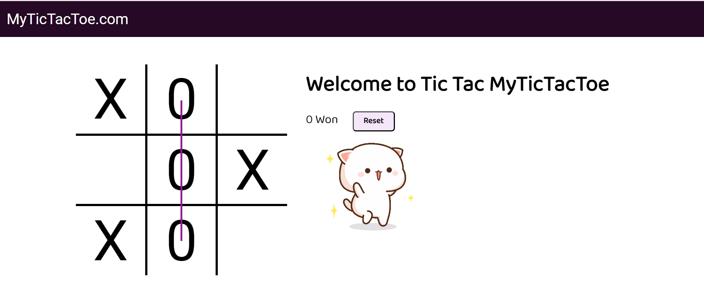

# Tic-Tac-Toe Game

Welcome to the **Tic-Tac-Toe Game**! This is a classic two-player game where each player takes turns marking a cell in a 3x3 grid with either "X" or "O". The first player to align three of their marks in a horizontal, vertical, or diagonal row wins the game.

 <!-- Replace this URL with an actual screenshot URL -->
# [Deployment Link](https://my-tic-tac-toe-lite.netlify.app)
## Features

- **Two Players**: Play with a friend in a two-player mode.
- **Winning Animation**: Visually see the winning line when a player wins.
- **Reset Functionality**: Easily reset the game to start a new round.
- **Audio Effects**: Enjoy sound effects for player turns, game start, and game over.
- **Responsive Design**: Play the game on any device, from desktops to mobile phones.

## Installation

1. **Clone the repository:**
   ```bash
   git clone https://github.com/ravikumar9519/Tic-Tac-Toe.git
   
## How to Play

1. The game starts with player "X".
2. Players take turns clicking on an empty cell in the 3x3 grid.
3. The first player to get three of their marks in a row (horizontally, vertically, or diagonally) wins the game.
4. If all nine cells are filled and no player has three in a row, the game ends in a draw.
5. Click the "Reset" button to start a new game.


## Project Structure

```plaintext
├── index.html        # The main HTML file
├── style.css         # The CSS file for styling
├── script.js         # The JavaScript file containing the game logic
├── music.mp3         # Background music file
├── ting.mp3          # Sound effect for turn change
├── gameover.mp3      # Sound effect for game over
└── README.md         # This README file
```
## Contributing

Contributions are welcome! Please fork the repository and create a pull request with your improvements.

## Contact

For any questions or feedback, please contact [Ravi Bharti](mailto:ravikumarbharti959493@gmail.com).
